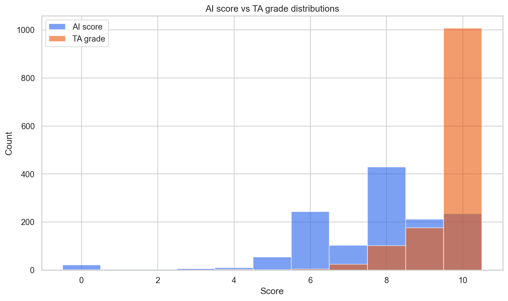
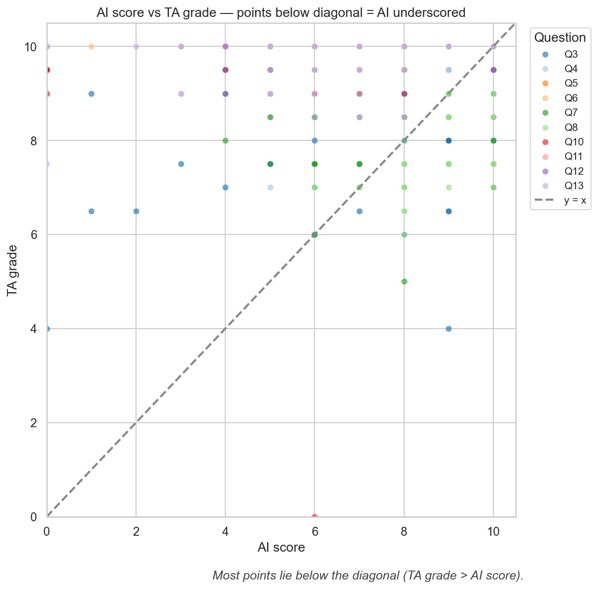
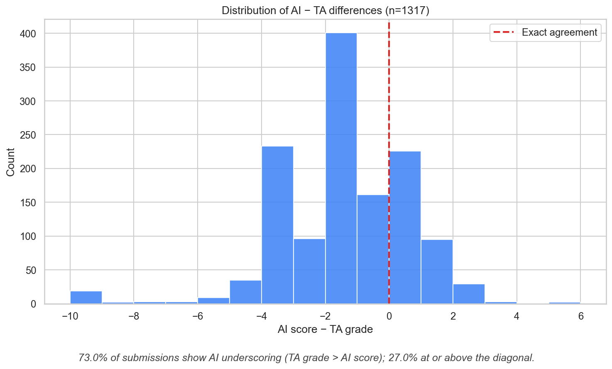
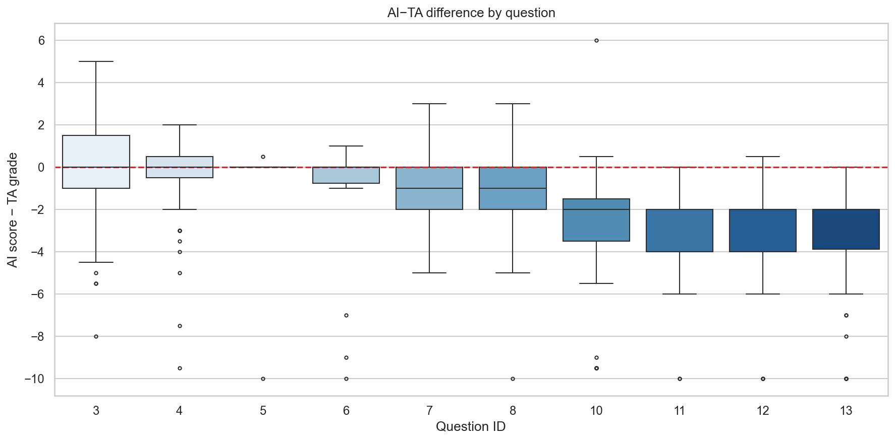
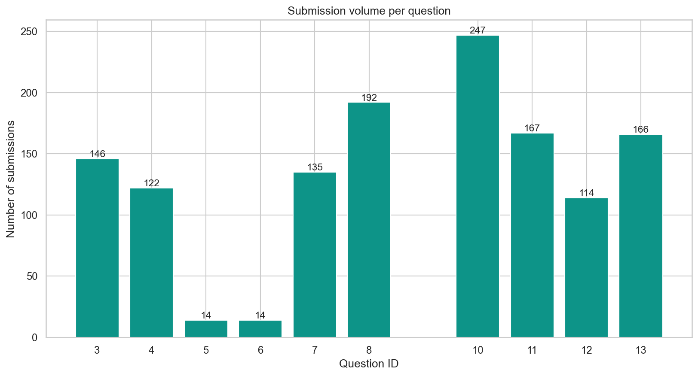
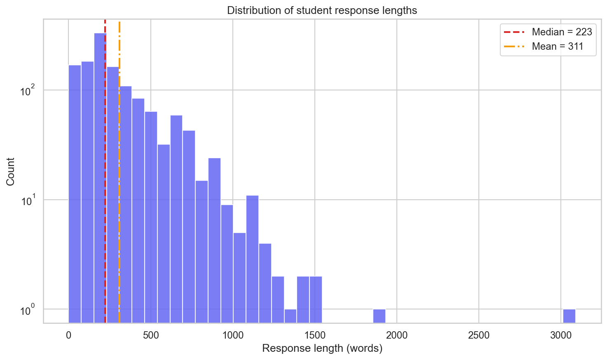

# Data Analysis Report

## 1. Dataset overview

- **Source file:** `data/qry6114_2025f_autograding_final.xlsx`
- **Course context:** ITCS 6114 autograding export (Professor Cheng), peer + AI grading with TA final grades
- **Time range:** 2025-08-25 18:39:19.789000 to 2025-11-20 05:24:15.841000
- **Raw rows:** 1520 submissions × 11 columns

**Columns (raw):**

| Column | Description |
|--------|-------------|
| `submission_id` | Unique submission identifier |
| `submitter_id` | Student identifier |
| `questions_id` | Question / rubric item ID |
| `question_txt` | Question prompt text |
| `response_txt` | Student answer text |
| `timestamp` | Submission time |
| `ai_score` | Automated AI score (typically 0–10) |
| `peer_score` | Peer review score (often missing) |
| `ai_feedback` | AI-generated feedback |
| `peer_feedback` | Peer feedback (often missing) |
| `TA_Grade` | TA final grade after review |

**Filter applied:** 1317 rows retained after dropping missing scores and **excluding `questions_id == 9`**. Question 9 uses a 0–20 TA scale while the AI stays on 0–10, so including it would mix incompatible scales.

## 2. Score distributions

**AI score**

| Mean | 7.733 |
| Median | 8.000 |
| Std dev | 1.860 |
| Min | 0.000 |
| Max | 10.000 |

**TA grade**

| Mean | 9.490 |
| Median | 10.000 |
| Std dev | 0.884 |
| Min | 0.000 |
| Max | 10.000 |

## 3. The central finding: AI is systematically harsh

- **Mean (AI − TA):** -1.756 — negative values mean the TA typically grades *higher* than the AI.
- **Submissions where TA > AI (AI underscored):** 73.0%
- **Submissions with any TA adjustment (TA ≠ AI):** 87.5%

## 4. Per-question breakdown

| Question | n | Mean AI | Mean TA | Mean (AI−TA) |
|---------:|--:|--------:|--------:|-------------:|
| 3 | 146 | 8.29 | 8.45 | -0.16 |
| 4 | 122 | 9.07 | 9.30 | -0.23 |
| 5 | 14 | 9.29 | 9.96 | -0.68 |
| 6 | 14 | 7.86 | 9.68 | -1.82 |
| 7 | 135 | 8.10 | 9.15 | -1.06 |
| 8 | 192 | 8.58 | 9.46 | -0.88 |
| 10 | 247 | 7.09 | 9.61 | -2.52 |
| 11 | 167 | 6.73 | 10.00 | -3.27 |
| 12 | 114 | 7.31 | 9.89 | -2.58 |
| 13 | 166 | 7.10 | 9.84 | -2.74 |

- **Largest average AI harshness (most negative mean diff):** question **11** (Q11 Fractional Knapsack) at -3.27.
- **Closest average agreement:** question **3** (Q3 Order notation) at -0.16.
- Algorithm-heavy items (Knapsack, BFS/DFS, MST/shortest paths) tend to show larger upward TA adjustments.

## 5. Data volume and balance

- **Questions represented:** 10 (IDs 1–13 except 9)
- **Unique students (`submitter_id`):** 79
- **Submissions per student:** mean 16.7, median 15, max 66
- Volume is **uneven across questions** — some items dominate the dataset.

## 6. Response characteristics

- **Response length (words):** mean 311, median 223, max 3090
- **AI feedback length (words):** mean 82, median 72, max 407

## 7. Key insights for modeling

- **The systematic AI bias is large enough to be learnable** — most submissions need a nonnegative TA bump, especially on harder algorithm questions.
- **Per-question variance is substantial** — `questions_id` (one-hot) should remain a core feature; a single global adjustment rule will miss item-specific behavior.
- **Response and feedback lengths vary by orders of magnitude** — normalize word counts (as in `grading_env.py`) rather than using raw lengths.

---

*Auto-generated by `src/data_analysis.py`*
